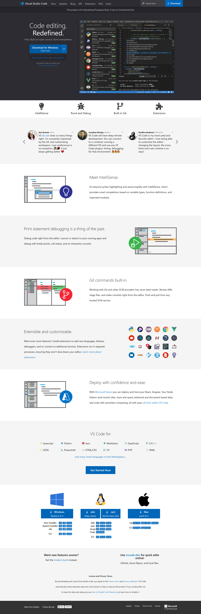

# Visual Studio Code Landing Page

Hi, this project is a clone of Visual Studio Code Landing Page. It is fully responsive and is built using HTML and Tailwind CSS. The project replicates the design, hover effects and aspects of the VS Code Landing Page.

## [Live Preview](https://vs-code-homepage-clone.netlify.app/)

Built with:

 
 
## Note:

This project is for Educational Purposes Only. It has no Commercial Use.

## Output:

